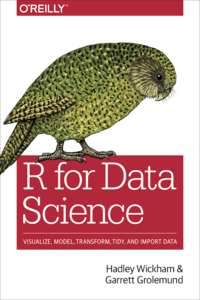
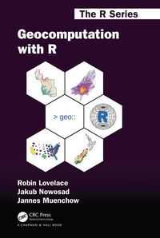
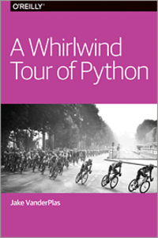
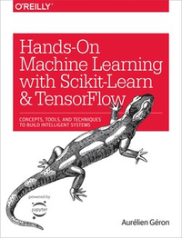
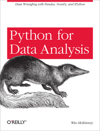
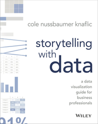
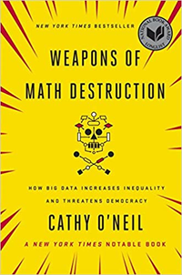

# Statistics
### [The Cartoon Guide to Statistics](http://www.larrygonick.com/titles/science/the-cartoon-guide-to-statistics/)
  
This is an engaging reference book which explains key concepts like descriptives statistics, distributions, probability, hypothesis testing.

### [The Manga Guide to Statistics](https://nostarch.com/sites/default/files/styles/uc_product_full/public/mg_statistics_big.png?itok=A7DJQynq)
  
Similar to the title above, but this book has a plot that runs through it so, if like me, you find analogies easier to remember than formulas, this is a great book for you.


# Data Science 

## R

### [R for Data Science](https://r4ds.had.co.nz/)  
  
After completing several [DataCamp](https://www.datacamp.com/profile/pevansimpson) courses, I started using R to analyze [test-taker data](https://educators-r-learners.netlify.app/post/coloring-under-the-lines-in-ggplot/) and this book was my go to reference for the [tidyverse](https://www.tidyverse.org/).

### [Geocomputation in R](https://geocompr.robinlovelace.net/)
  
My last position required my team and I to travel throughout East Asia to deliver workshops, presentations, and provide client support and I used this book to teach myself how to make maps to visualize our reach and impact. 

### [Blogdown: Creating Websites with R Markdown](https://bookdown.org/yihui/blogdown/)  
  
I would not have been able to create my previous blog without this book. It is indispensable if you want to create a blog with RStudio. 

## Python

### [A Whirlwind Tour of Python](https://jakevdp.github.io/WhirlwindTourOfPython/)
  
Need to get the gist of Python in a hurry? This is your book. 

### [Hands-On Machine Learning with Scikit-Learn and TensorFlow](https://www.oreilly.com/library/view/hands-on-machine-learning/9781491962282/) 
  
Chapter 2 End-to-End Machine Learning Project along with Appendix B: Machine Learning Project Checklist are worth the price of the book alone. 

### [Python for Data Analysis](http://shop.oreilly.com/product/0636920023784.do)
  
The real name of this book should be *Pandas from A-Z*. Seriously, work through the examples in Chapter 14 and you will feel infinitely more confident to use ```pandas``` in the future.  

## Concepts

### [Storytelling with Data](http://www.storytellingwithdata.com/books)
  
If "a picture is worth a thousand words," we should make sure it's conveying our intended message. This book you make your visuals convey precise meaning at a glance instead of serving as a distraction or being redundant. 

### [Weapons of Math Destruction](https://bookshop.org/books/weapons-of-math-destruction-how-big-data-increases-inequality-and-threatens-democracy/9780553418835)
  
It's good to be reminded that models are never neutral. 