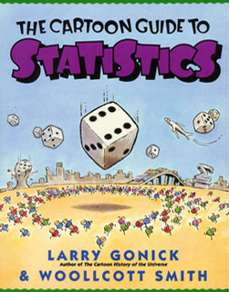
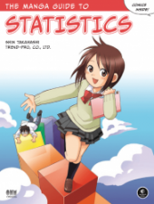

# Statistics
### [The Cartoon Guide to Statistics](http://www.larrygonick.com/titles/science/the-cartoon-guide-to-statistics/)

This is an engaging reference book which explains key concepts like descriptives statistics, distributions, probability, hypothesis testing.

### [The Manga Guide to Statistics](https://nostarch.com/sites/default/files/styles/uc_product_full/public/mg_statistics_big.png?itok=A7DJQynq)

Similiar to the title above, but this book has a plot that runs through it so, if like me, you find analogies easier to remember than forumulas, this is a great book for you.

# Data Science 

## R

### [R for Data Science](https://r4ds.had.co.nz/)  
  

After completeing several [DataCamp](https://www.datacamp.com/profile/pevansimpson) courses, I started using R to analyze [test-taker data](https://educators-r-learners.netlify.app/post/coloring-under-the-lines-in-ggplot/) and this book was my go to reference for the [tidyverse](https://www.tidyverse.org/).

